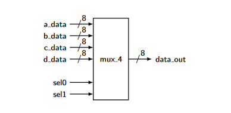

## General Introduction

1. These notes are summaries of the "Free Range VHDL" open source textboook which can be found [on github here](https://github.com/fabriziotappero/Free-Range-VHDL-book) and as a [pdf download here](https://freerangefactory.org/pdf/df344hdh4h8kjfh3500ft2/free_range_vhdl.pdf).
2. All examples come directly from the textbook unless otherwise stated.
3. These summaries also only cover up until chapter 5 since I became quite busy later in the semester and the fundamentals of vhdl were for the most part figured out by then.
4. these notes may not be used to present a course for money or be sold in any way. they are free.

## Table of contents

- [General Introduction](#general-introduction)
- [Table of contents](#table-of-contents)
- [Chapter 1](#chapter-1)
  - [Golden Rules of VHDL](#golden-rules-of-vhdl)
  - [Tools Needed](#tools-needed)
- [Chapter 2 VHDL Invariants](#chapter-2-vhdl-invariants)
  - [Case Sensitivity](#case-sensitivity)
  - [White Space](#white-space)
  - [Comments](#comments)
  - [Parentheses](#parentheses)
  - [VHDL Statements](#vhdl-statements)
  - [if, case and loop Statements](#if-case-and-loop-statements)
  - [Identifiers](#identifiers)
  - [Reserved Words](#reserved-words)
  - [VHDL Coding Style](#vhdl-coding-style)
    - [Example 1](#example-1)
- [Chapter 3 VHDL Design Units](#chapter-3-vhdl-design-units)
  - [Black Box Approach](#black-box-approach)
  - [Entity](#entity)
    - [Example 2](#example-2)
  - [VHDL Standard Libraries](#vhdl-standard-libraries)
  - [Architecture](#architecture)
  - [Signal and Variable Assignments (object types)](#signal-and-variable-assignments-object-types)
    - [Example 3](#example-3)
- [Chapter 4 VHDL Paradigm](#chapter-4-vhdl-paradigm)
  - [Concurrent Statements](#concurrent-statements)
  - [Signal Assignment Operator](#signal-assignment-operator)
  - [Concurrent Signal Assignment Statements](#concurrent-signal-assignment-statements)
    - [Example 4](#example-4)
  - [Conditional Signal Assignment ``when``](#conditional-signal-assignment-when)
    - [Example 5](#example-5)
    - [Example 6](#example-6)
  - [Selected Signal Assignment ```with select```](#selected-signal-assignment-with-select)
    - [Example 7](#example-7)
    - [Example 8](#example-8)
  - [Process Statement](#process-statement)
- [Chapter 5 Standard Models in VHDL Architectures](#chapter-5-standard-models-in-vhdl-architectures)
  - [Data flow Style Architecture](#data-flow-style-architecture)
  - [Behavioral Style Architecture](#behavioral-style-architecture)
  - [Process Statement](#process-statement-1)
    - [Example 9](#example-9)
  - [Sequential Statements](#sequential-statements)
    - [Example 10](#example-10)
  - [Caveats Regarding Sequential Statements](#caveats-regarding-sequential-statements)
- [Chapter 6 VHDL Operators](#chapter-6-vhdl-operators)
  - [Logical](#logical)
  - [Relational](#relational)
  - [Shift](#shift)
  - [Other](#other)
  - [Concatenation](#concatenation)
  - [Modulus and Remainder](#modulus-and-remainder)

## Chapter 1

### Golden Rules of VHDL

1. VHDL is a hardware-design language you are designing circuits not making programs
2. Have a general concept of what your hardware should look like.

### Tools Needed

*This section is mostly unimportant,  just understand what an FPGA is and how most of the stuff surrounding them is proprietery and that there are open source ways to do it*

---

## Chapter 2 VHDL Invariants

### Case Sensitivity

1. VHDL is not case sensitive

```VHDL
Dout <= A and B;
--is the same as:
dOuT <= a aNd B;
```

2. but the second example is not good practice

### White Space

1. VHDL is not sensitive to white space

```VHDL
Dout <= A and B;
--is the same as:
dOuT 	<=a aNd 		B  ;
```

2. again the second example is not good practice

### Comments

1. a comment begins and ends with 2 dashes (**-**) as seen above
2. there are no block style comments

### Parentheses

1. Use brackets wherever possible then you don't have to worry about order of operations
2. Use as many parentheses as necessary to clearly display functions


### VHDL Statements

1. Every VHDL statement is terminated with a semicolon (**;**)
2. There are some exceptions to this rule

### if, case and loop Statements

1. Every ``if`` statement has a corresponding ``then`` component
2. Each ``if`` statement is terminated with an ``end if;``
3. If you need to use an ``else if`` construct, the VHDL version is ``elsif``
4. Each ``case`` statement is terminated with an ``end case;``
5. Each ``loop`` statement has a corresponding end ``loop;`` statement

### Identifiers

1. the term used to describe variable names, signal names and port names in VHDL (similar to identifiers use to describe variable names and function
names in other languages)
2. Identifiers should be self-describing
3. Identifiers can be as long as you want
4. Identifiers can only contain a combination of letters (A-Z and a-z), digits (0-9) and the underscore character (“\_”)
5. Identifiers must start with an alphabetic character
6. Identifiers must not end with an underscore and must never have two consecutive underscores
7. examples of good identifiers are:
    - CalcEarthPosition or calc\_earth\_position
    - AgeMyCar or age\_my\_car

> note: it is important to remain consistent in your style of identifier names. If you use ```CalcEarthPosition``` you should then also use ```AgeMyCar```, similarly  if you use ```calc_earth_position``` you should then also use ```age_my_car```

### Reserved Words

1. Reserved words cannot be used as identifiers
2. the following is a list of the most common reserved words in vhdl

```vhdl
access   after      alias       all        attribute    block
body     buffer     bus         constant   exit         file
for      function   generic     group      in           is
label    loop       mod         new        next         null
of       on         open        out        range        rem
return   signal     shared      then       to           type
until    use        variable    wait       while        with
```

### VHDL Coding Style

1. make your code neat so that anyone can read and understand what your were trying to do
2. use comments to present info about your design that woulsd not be apparent otherwise as well as any info that would make your code more clear.
3. if you struggling figuring out what *good* VHDL looks liek just model your programs after the examples in a good book/document
4. the following is an example of good code

#### Example 1

```vhdl
-- library declaration
library IEEE;
use IEEE.std_logic_1164.all;

-- entity
entity my_4t1_mux is
    port (D3,D2,D1,D0 	: in std_logic;
    SEL         		: in std_logic_vector(1 downto 0);
    MX_OUT      		: out std_logic);
end my_4t1_mux;

-- architecture
architecture mux4t1_2 of my_4t1_mux is
begin
    with SEL select
        MX_OUT <= D3  when "11",
        D2  when "10",
        D1  when "01",
        D0  when "00",
        '0' when others;
end mux4t1_2;
```

---

## Chapter 3 VHDL Design Units

### Black Box Approach

1. the "Black Box Approach" describes a heirarchy
    2. the black box is the **Entity**
    3. the stuff inside the box is the **Architecture**


### Entity

1. Lists all the inputs and outputs

#### Example 2

```vhdl
entity my_entity is
port(
    port_name_1, port_name_2	: in std_logic;
    bundle_name 				: out std_logic_vector(0 downto 7);
    port_name_3 				: inout std_logic); --note the semicolon
end my_entity;
```

2. ``port_name_x`` is an identifier used to differentiate the
various signals
3. ``in``, ``out``, and ``inout`` indicates direction of the signal
4. ``std_logic`` and ``std_logic_vector`` are the data types being handled by the port
    - the ``std_logic`` and ``std_logic_vector`` datatypes are only available after the declaration of the IEE library\
    - the ``bit`` data type is available without this library and contains only the logic values 1 and 0
5. ``to`` and ``downto`` indicate a *bundle*

    > **bundles** or bus signals:
    >
    > - Data type
    > - Essentially multiple signals that can utilise the same port
    > - Multiple signals (elements) differing by only one numeric character that share a similar purpose.
    > - Listed with ``to`` and ``downto`` keywords.
    >
    > note the representation of bundles on a block diagram
    >
    > 

6. Some rules regarding the entity
    1. Each port name is unique and has an associated mode and data type
    2. Multiple port names can be included on a single line

> **note**: in Quartus Prime the first entity name, name of project and name of the VHDL filemust be the same

### VHDL Standard Libraries

1. the ``IEEE Standard 1164`` package was an import standardization
2. for ERS220 the main package libraries will be
    - ``std_logic_1164``
    - ``numeric_std``
3. see the [code example](#example-1) at the end of chapter 1's summary for the implementation.

### Architecture

1. the meat of the code
2. there are 3 main ways to code vhdl in the architecture
    1. [dataflow](#data-flow-style-architecture)- concurrent logic
    2. [behavioral](#behavioral-style-architecture) - procedural logic (similar to other languages like c++ or python)
    3. [structural](#structural)
      -  Structural modeling is essentially a method to combine an existing set of VHDL models. it supports the interconnection of black boxes but does not have the ability to describe the logic functions used to model the circuit operation.

### Signal and Variable Assignments (object types)

1. signal
    - software representation of a wire
    - used like an intermediary variable in other languages
    - declared like a port but without an ```in```, ```out```, or ```inout``` underneath the architecture heading
    - use '<=' for assignments
    - signal assignments can happen after some time
2. variable
    - you should know this one
    - declared inside the *process construct*
    - **NB** use ':=' for assignments
    - variable assignmnets are instant
3. constant
    - like a variable but value cannot be changed

#### Example 3

```vhdl
architecture circuit1_arc of circuit1 is
    signal sig_1: std_logic;				-- signal definition
begin
    process (a,b,c)							-- process construct (i.e. procedural logic
                                            -- or behavioural model)
        variable var_1 : integer;			-- var definition
    begin
        F 		<= 	not (A and B and C);	-- signal assignment
        sig_1 	<= A;						-- signal assignment
        var_1 	:= 34;						-- variable asignment
    end process;

    G <= not (A and B);						-- concurrent assignment
end circuit1_arc;
```

---

## Chapter 4 VHDL Paradigm

### Concurrent Statements

1. all steps occur at the same time (in parallel)
2. statements are updted when signals change
3. this is the core of VHDL

### Signal Assignment Operator

1. takes the form

    ```vhdl
    <target> <= <expression>;
    ```

2. the signal on the left-hand side of the signal assignment operator is
dependent upon the signals on the right-hand side of the operator
3. there are multiple ways to solve the same problems
4. Signals declared as outputs cannot be on the right-hand side of a signal assignment operator, This problem is solved by using **intermediate signals**

### Concurrent Signal Assignment Statements

1. intermediate signals provide us with intermediate results andhelp us to simplify complicated problems
2. for concurrent statements the outputs are updates when a signal is changed

#### Example 4

for the equation ``F3=L'M'N+LM``

```vhdl
-- library declaration
library IEEE;
use IEEE.std_logic_1164.all;
-- entity
entity my_ckt_f3 is
port (	L,M,N  : in std_logic;
        F3     : out std_logic);
end my_ckt_f3;
-- architecture
architecture f3_1 of my_ckt_f3 is
    signal A1, A2 :std_logic; -- intermediate signals
begin
    A1 <= ((NOT L) AND (NOT M) AND N);
    A2 <= L AND M;
    F3 <= A1 OR A2;
end f3_1
```

### Conditional Signal Assignment ``when``

1. like the ```if``` statement of concurent assignments
2. good practice to 'catch' errors with a 0 at the end (called a 'catch-all condition')
3. takes the form:

    ```vhdl
    <target> <= <expression> when <condition> else
                <expression> when <condition> else
                <expression>;
    ```

4. only one signal assignment operator for each conditional assignmnent statement
5. very useful to implement multiplexers
    - the conditions become values of the select inputs
    - see [Example 6](#example-6)

#### Example 5

for the same equation as in [Example 4](#example-4)

```vhdl
architecture f3_3 of my_ckt_f3 is
begin
    F3 <=	'1' when (L = '0' AND M = '0' AND N = '1') else
            '1' when (L = '1' AND M = '1') else
            '0';
end f3_3;
```

#### Example 6

```vhdl
-- library declaration
library IEEE;
use IEEE.std_logic_1164.all;
-- entity
entity my_4t1_mux is
port(	D3,D2,D1,D0 : in std_logic;
        SEL 		: in std_logic_vector(1 downto 0);
        MX_OUT 		: out std_logic);
end my_4t1_mux;
-- architecture
architecture mux4t1 of my_4t1_mux is
begin
    MX_OUT <= D3 when (SEL = "11") else
    D2 when (SEL = "10") else 		-- is equivalent to 'D2 when (SEL(1) = '1' and SEL(0)' ='0') else
    D1 when (SEL = "01") else
    D0 when (SEL = "00") else
    '0';
end mux4t1;
```

### Selected Signal Assignment ```with select```

1. like the switch stament in regular programming languages
2. similar conditional signal assignment but based on the evaluation of one expression
3. takes the form:
    ```vhdl
    with <choose_expression> select
        target <= 	<expression> when <choices>,
                    <expression> when <choices>;
    ```

4. the catch all statement is implemented with ``` when others```
5. <p>multiple options for the same output can be made simple with a selection character, namely '|'</p>
    - see [Example 8](#example-8)

#### Example 7

implementing the same multiplexer as [Example 6](#example-6)

```vhdl
-- library declaration
library IEEE;
use IEEE.std_logic_1164.all;
-- entity
entity my_4t1_mux is
    port (	D3,D2,D1,D0 : in std_logic;
            SEL         : in std_logic_vector(1 downto 0);
            MX_OUT      : out std_logic);
end my_4t1_mux;
-- architecture
architecture mux4t1_2 of my_4t1_mux is
begin
    with SEL select
        MX_OUT <= D3  when "11",
        D2  when "10",
        D1  when "01",
        D0  when "00",
        '0' when others;
end mux4t1_2;
```

#### Example 8

```vhdl
architecture spec_dec of my_sz_ckt is
begin
    with D_IN select
        SZ_OUT <= 	"100" when "0000"|"0001"|"0010"|"0011",
                    "010" when "0100"|"0101"|"0110"|"0111"|"1000"|"1001",
                    "001" when "1010"|"1011"|"1100"|"1101"|"1110"|"1111",
                    "000" when others;
end spec_dec;
```

### Process Statement

1. the process statement itself is concurrent although its contents are executed sequentially

---

## Chapter 5 Standard Models in VHDL Architectures

### Data flow Style Architecture

1. everything upuntil this point has been data flow (apart from the process statementexample used in [Example 2](#example-2))
2. specifies a circuit as a concurrent representation oftheflowof data through a circuit
3. three forms of concurrent statements
    1. [Concurrent Signal Assignment (CSA) Statements](#concurrent-signal-assignment-statements)
    2. [Conditional Signal Assignment ](#conditional-signal-assignment)
    3. [Selected Signal Assignment](#selected-signal-assignment)
4. better for small/simple circuits

>note: Concurrentm, Conditional, and Selected aiganl asignments **cannot** be nested

### Behavioral Style Architecture

1. doesnt reflect how the circuit is implemented when synthesized
2. dont need to fully understand how the circuit should look in order to implement using behavioral style, leaves the figuring out to the VHDL synthesizer
3. initiated with a process statement

### Process Statement

1. takes the form:

    ```vhdl
    my_label : process(sensitivity_list) is
        <item_declaration>
    begin
        <sequential_statements>
    end process my_label;
    ```

2. every time there is a signal change in the process **sensitivity list** all of the sequential statements are re-evaluated

> **remember**:
> the process statement itself is concurrent although its contents are executed sequentially

#### Example 9

for an XOR

```vhdl
-- library declaration
library IEEE;
use IEEE.std_logic_1164.all;
-- entity
entity my_xor is
    port ( 	A,B : in std_logic;
            F   : out std_logic);
end my_xor;
-- architecture
architecture behav of my_xor is
begin
    xor_proc: process(A,B) is
    begin
    F <= A XOR B;
    end process xor_proc;
end behav;
```

### Sequential Statements

1. works similar to regular programming labnguages
2. due to concurrent nature of the process statement which contains sequestial statements it is important to keep the sequential statements as simple a possible
3. [Signal Assignment Statement](#signal-assignment-operator)
4. if statement
    - takes form:

    ```vhdl
    if (condition) then
        <statements>
    elsif (condition) then
        <statements>
    else
        <statements>
    end if;
    ```

    - can be nested

5. case statement
    - takes form:

    ```vhdl
    case (expression) is
    when choices =>
        <sequential statements>
    when choices =>
        <sequential statements>
    when others =>
        <sequential statements>
    end case;
    ```

    - can be nested
    - [Example 10](#example-10)

#### Example 10

```vhdl
architecture my_soln_exam of my_example is
    signal ABC:std_logic_vector(2 downto 0);
begin
    ABC <= A & B & C; -- group signals for case statement
    my_proc: process (ABC)
    begin
        case (ABC) is
        when "100"  => F_OUT <= '1';
        when "-11"  => F_OUT <= '1';	-- the '-' is a dont care operator
        when others => F_OUT <= '0';
        end case;
    end process my_proc;
end my_soln_exam;
```

>**note**:
> *dont care operator*  '-'
>
> the character in its place can be a 1 or a 0 without affecting the following statement

### Caveats Regarding Sequential Statements

1. your implementations can become too similar to that of a higher level language
2. keep models simple to avoid most problems

---

## Chapter 6 VHDL Operators

### Logical

1. AND
2. NOR
3. OR
4. NAND
5. XOR
6. XNOR
7. NOT

### Relational

1. = is equal to
2. /= is not equal to
3. <
4. <=
5. \>
6. \>=

### Shift

1. basically shift bits either left or right

### Other

### Concatenation

### Modulus and Remainder

...
